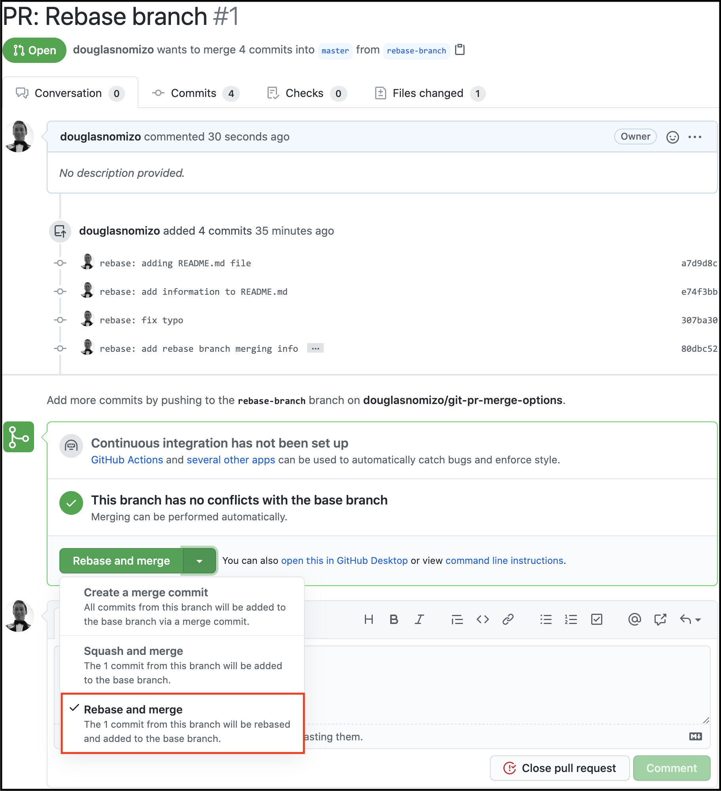

# Github Merge Options

## Goal

The goal of this repository is to provide examples of using Github PR merging options (**Merge**, **Squash and Merge** and **Rebase and Merge**) and show how they affect the `master` branch history.

More information can be found here: [Merge methods on GitHub](https://docs.github.com/en/github/administering-a-repository/about-merge-methods-on-github)

## Branches

All branches will be merged into master using the option defined by their names:
- `rebase-branch`
- `squash-branch`
- `merge-branch`

## Rebase and Merge

All commits from `rebase-branch` are added to `master`
In this example we have the following commits:
- `rebase: adding README.md file`
- `rebase: add information to README.md`
- `rebase: fix typo`
- `rebase: add rebase branch merging info`

## Squash and Merge

All commits from `squash-branch` turn into a single commit that is added to `master`
When merging, Github allows you to update the commit message to explain the purpose of the PR.
In this example we have the following commits:
- `squash: add some images about rebase and merge option`
- `squash: update image to focus on Github option for rebase`
- `squash: add squash information and .gitignore`

## Merge (Create a merge commit)

This is the default method. All commits from `merge-branch` are added to `master` and it also generates a merge commit.
In this example we have the following commits:
- `merge: add borders to images`
- `merge: adds information about Github merge option`
- `merge: clean up README`

### Author

Douglas Nomizo